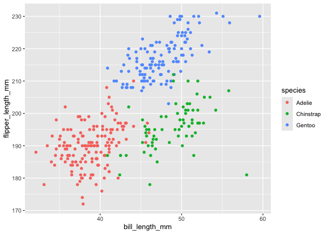

p8105_hw1_hca2124
================
Helene Apollon
2026-10-07

``` r
library(tidyverse)
```

    ## ── Attaching core tidyverse packages ──────────────────────── tidyverse 2.0.0 ──
    ## ✔ dplyr     1.2.1     ✔ readr     2.2.0
    ## ✔ forcats   1.0.1     ✔ stringr   1.6.0
    ## ✔ ggplot2   4.0.3     ✔ tibble    3.3.1
    ## ✔ lubridate 1.9.5     ✔ tidyr     1.3.2
    ## ✔ purrr     1.2.2     
    ## ── Conflicts ────────────────────────────────────────── tidyverse_conflicts() ──
    ## ✖ dplyr::filter() masks stats::filter()
    ## ✖ dplyr::lag()    masks stats::lag()
    ## ℹ Use the conflicted package (<http://conflicted.r-lib.org/>) to force all conflicts to become errors

``` r
data("penguins", package = "palmerpenguins")
names (penguins)
```

    ## [1] "species"           "island"            "bill_length_mm"   
    ## [4] "bill_depth_mm"     "flipper_length_mm" "body_mass_g"      
    ## [7] "sex"               "year"

``` r
penguins = janitor::clean_names(penguins)
```

The ‘penguins’ dataset includes different measurments of penguins and
their body parts. It has ‘r nrow(penguins)’ rows and ‘r ncol(penguins)’
columns. The mean flipper length is ‘r mean(pull(penguins,
flipper_length_mm), na.rm = TRUE)’

``` r
skimr::skim(penguins)
```

|                                                  |          |
|:-------------------------------------------------|:---------|
| Name                                             | penguins |
| Number of rows                                   | 344      |
| Number of columns                                | 8        |
| \_\_\_\_\_\_\_\_\_\_\_\_\_\_\_\_\_\_\_\_\_\_\_   |          |
| Column type frequency:                           |          |
| factor                                           | 3        |
| numeric                                          | 5        |
| \_\_\_\_\_\_\_\_\_\_\_\_\_\_\_\_\_\_\_\_\_\_\_\_ |          |
| Group variables                                  | None     |

Data summary

**Variable type: factor**

| skim_variable | n_missing | complete_rate | ordered | n_unique | top_counts |
|:---|---:|---:|:---|---:|:---|
| species | 0 | 1.00 | FALSE | 3 | Ade: 152, Gen: 124, Chi: 68 |
| island | 0 | 1.00 | FALSE | 3 | Bis: 168, Dre: 124, Tor: 52 |
| sex | 11 | 0.97 | FALSE | 2 | mal: 168, fem: 165 |

**Variable type: numeric**

| skim_variable | n_missing | complete_rate | mean | sd | p0 | p25 | p50 | p75 | p100 | hist |
|:---|---:|---:|---:|---:|---:|---:|---:|---:|---:|:---|
| bill_length_mm | 2 | 0.99 | 43.92 | 5.46 | 32.1 | 39.23 | 44.45 | 48.5 | 59.6 | ▃▇▇▆▁ |
| bill_depth_mm | 2 | 0.99 | 17.15 | 1.97 | 13.1 | 15.60 | 17.30 | 18.7 | 21.5 | ▅▅▇▇▂ |
| flipper_length_mm | 2 | 0.99 | 200.92 | 14.06 | 172.0 | 190.00 | 197.00 | 213.0 | 231.0 | ▂▇▃▅▂ |
| body_mass_g | 2 | 0.99 | 4201.75 | 801.95 | 2700.0 | 3550.00 | 4050.00 | 4750.0 | 6300.0 | ▃▇▆▃▂ |
| year | 0 | 1.00 | 2008.03 | 0.82 | 2007.0 | 2007.00 | 2008.00 | 2009.0 | 2009.0 | ▇▁▇▁▇ |

``` r
mean(pull(penguins, flipper_length_mm), na.rm = TRUE)
```

    ## [1] 200.9152

``` r
round(mean(penguins$flipper_length_mm, na.rm = TRUE), 2)
```

    ## [1] 200.92

The mean flipper_length_mm is 200.92 with standard deviaition of 14.06

``` r
library(tidyverse)
flipper_bill_plot =
  ggplot(penguins, aes(x = bill_length_mm,
                       y = flipper_length_mm, color = species)) + 
  geom_point() 
flipper_bill_plot 
```

    ## Warning: Removed 2 rows containing missing values or values outside the scale range
    ## (`geom_point()`).

<!-- -->

``` r
ggsave("flipper_bill_plot.pdf")
```

    ## Saving 7 x 5 in image

    ## Warning: Removed 2 rows containing missing values or values outside the scale range
    ## (`geom_point()`).
